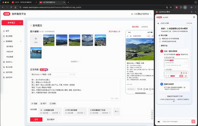
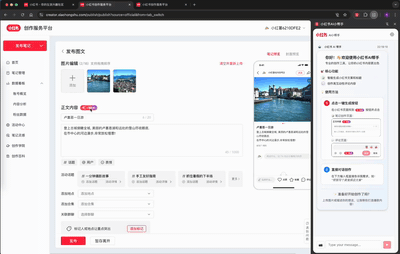
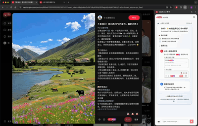

# Xiaohongshu AI Content Assistant | 小红书 AI 工具小帮手

> **Professional AI Assistant for Xiaohongshu Content Creation** - A powerful Chrome browser extension designed specifically for Xiaohongshu (Little Red Book) content creators. Integrates mainstream AI models like OpenAI GPT, Claude, and Qwen to intelligently generate high-quality content, titles, and comments, enhancing content creation efficiency.

**Keywords**: Xiaohongshu, AI Content Generation, Chrome Extension, Content Creation, Smart Writing, GPT, Claude, Qwen, Social Media Tools

📖 **[中文文档](./README.md)** | 🌐 **English Documentation**

### 📺 Feature Demonstration

#### 📝 Content Generation Demo

#### 💬 Comment Generation Demo

## 📦 Quick Installation

### 🏪 Method 1: Chrome Web Store (Recommended)

1. Open [Chrome Web Store](https://chrome.google.com/webstore)
2. Search for **"Xiaohongshu AI Assistant"** (under review)
3. Click **"Add to Chrome"** to complete installation
4. The extension icon will appear in your browser toolbar after installation

### 💻 Method 2: Developer Local Installation

1. **Download Extension Package**
   Click to download [Installation Package](https://github.com/XiaoruiWang-SH/xhs-ai-tool/raw/main/release/release.zip)

2. **Install to Chrome**
   - Open Chrome browser
   - Enter `chrome://extensions/` in the address bar
   - Enable **"Developer mode"** in the top right corner
   - Click **"Load unpacked extension"**
   - Select the extracted `release` folder (containing manifest.json)
   - Click the icon to open the sidebar and start using

## 🚀 Core Features

### ✨ AI Intelligent Content Generation

- **📝 Smart Content Creation**: Automatically generates eye-catching Xiaohongshu titles and content based on image content and user input
- **💬 AI Comment Assistant**: Intelligently analyzes Xiaohongshu post content to generate personalized, valuable interactive comments
- **🎯 Content Optimization Suggestions**: Provides SEO-friendly title optimization and content structure recommendations

### ⚡ Efficient User Experience

- **🔄 One-Click Application**: AI-generated content can be directly inserted into Xiaohongshu editing pages without copy-paste
- **📱 Sidebar Integration**: Chrome sidebar design that doesn't interfere with the original browsing experience
- **⚙️ Custom Templates**: Supports personalized prompt templates to adapt to different creative styles

### 🤖 Multi-Model AI Support

- **OpenAI GPT Series**: Supports GPT-5 for professional content generation
- **Claude Sonnet**: Anthropic Claude-4 model, excels in creative content creation
- **Qwen**: Alibaba Cloud Qwen model, Chinese content optimization expert

### 🔒 Privacy and Security

- **Local Storage**: API keys are only stored in local browser, not uploaded to servers
- **Data Privacy**: Images and text are only used for AI analysis, not saved or shared
- **Compliant Usage**: Fully complies with Xiaohongshu platform terms of service and community guidelines

## 📖 Detailed User Guide

### 🔧 Initial Setup

1. **Open Settings Panel**

   - Click the ⚙️ icon in browser toolbar
   - Select AI model
   - Enter API key

2. **Save Configuration**

### ✍️ Smart Content Generation

1. **Visit Xiaohongshu Creation Page**

   - Open [Xiaohongshu](https://www.xiaohongshu.com) and log in
   - Click "Post Note" to start creating

2. **Upload Images and Generate Content**

   - Upload your images to Xiaohongshu editor
   - Click extension icon to open AI assistant
   - Select appropriate content template
   - Click "Generate Content" and wait for AI creation
   - One-click apply generated titles and content

3. **Custom Optimization**
   - Modify AI prompt templates
   - Specify content style and length
   - Batch generate multiple versions for selection

### 💬 Smart Comment Assistant

1. **Browse Xiaohongshu Content**

   - Open any Xiaohongshu post page
   - AI will automatically recognize page content (title, images, text)

2. **Generate Personalized Comments**
   - View content overview in sidebar
   - Select comment style (friendly interaction, professional advice, humor, etc.)
   - Click "Generate Comment" to get AI suggestions
   - Copy or directly insert into comment section

### 🌟 Support the Project

If this project helps you, please consider:

- ⭐ Give the project a Star
- 🔄 Share with more friends
- 💡 Suggest improvements
- 🐛 Report issues

### Disclaimer:

- This tool is for educational and communication purposes only
- Users assume risks of usage
- Please comply with relevant platform terms of service
- Users are responsible for the authenticity of generated content

---